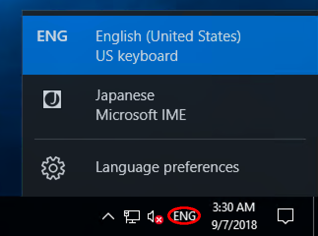
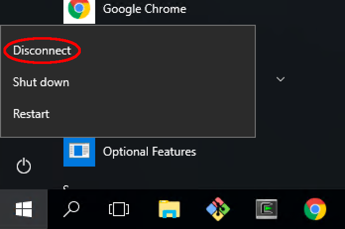

# Class Preparation Instructions

## Background

These instructions describe the steps to prepare for the 
xtUML training class.   

## Virtual Machine 

### 1. Log in
* Launch __Remote Desktop Connection__   

* Enter one of the available IP Addresses: __13.115.34.116__   

* Enter login info (user, password): student, Robots1   

* Click "Yes" to the Certificate Warning dialog   
* Windows desktop is shown   

### 2. Start BridgePoint
* Start BridgePoint using the desktop shortcut   

* Test usability, play with the Welcome > Quick Start > Microwave Oven example  
* Exit BridgePoint  

### 3. Test Japanese Language
* Change the language to Japanese   

* Start BridgePoint again.  Test usability.   

### 4. Git setup
* Every time an instance is launched, you must set up your git identity. 
* Run the "SetupGit" desktop shortcut script 
  * The script sets your name and email for commits
  * The script fetches your fork of the models repository and sets your fork’s “master” as the upstream branch for local “master”
* On the first push, your github.com username and password (or personal access token if 2FA is enabled) are required. After this, they are cached and will not be required again.

__Note:__ from inside git-bash and cygwin, the C: drive is at /c

### 5. Disconnect
* To exit the session, use Start > Power > Disconnect   

## Build Sumo Robot
* Follow the instructions to [construct the Sumo robot](https://xtuml.github.io/sumo/) using the EV3 kit

## Congratulations

You have completed your class preparations.
