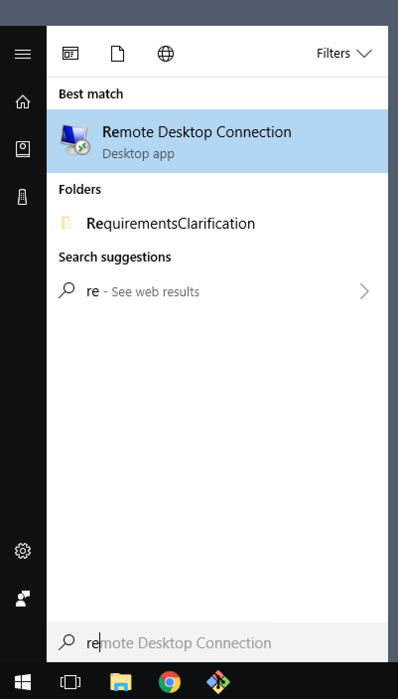

# Class Preparation Instructions

These instructions describe the steps to prepare for the 
xtUML training class.   

* [Virtual Machine](#1.)
  * [Log in](#1.1.)
  * [Start BridgePoint](#1.2.)
  * [Test Japanese language](#1.3.)
  * [Git setup](#1.4.)
  * [Disconnect](#1.5.)
* [Build Sumo Robot](#2.)

##  1. Virtual Machine 

###  1.1. Log in
* Launch __Remote Desktop Connection__   
{:height="703" width="401"}  
* Enter one of the available IP Addresses: __13.115.34.116__, __18.179.35.212__      
{:height="524" width="834"}  
* Enter login info (user, password): student, Robots1   
{:height="644" width="934"}  
* Click "Yes" to the Certificate Warning dialog   
* Windows desktop is shown   

###  1.2. Start BridgePoint
* Start BridgePoint using the desktop shortcut   
{:height="804" width="152"}
* Test usability, play with the Welcome > Quick Start > Microwave Oven example  
* Exit BridgePoint  

###  1.3. Test Japanese language
* Change the language to Japanese   
{:height="480" width="646"}
* Start BridgePoint again.  Test usability.   

###  1.4. Git setup
* The first time you log in you must set up your git identity 
* Run the "SetupGit" desktop shortcut script 
  * The script sets your name and email for commits
  * The script fetches your fork of the models repository and sets your fork’s “master” as the upstream branch for local “master”
* On the first push, your github.com username and password (or personal access token if 2FA is enabled) are required. After this, they are cached and will not be required again.

__Note:__ from inside git-bash and cygwin, the C: drive is at /c

###  1.5. Disconnect
* To exit the session, use Start > Power > Disconnect   
{:height="492" width="696"}

##  2. Build Sumo Robot
* Follow the instructions to [construct the Sumo robot](https://xtuml.github.io/sumo/) using the EV3 kit

## Congratulations!

You have completed your class preparations.
