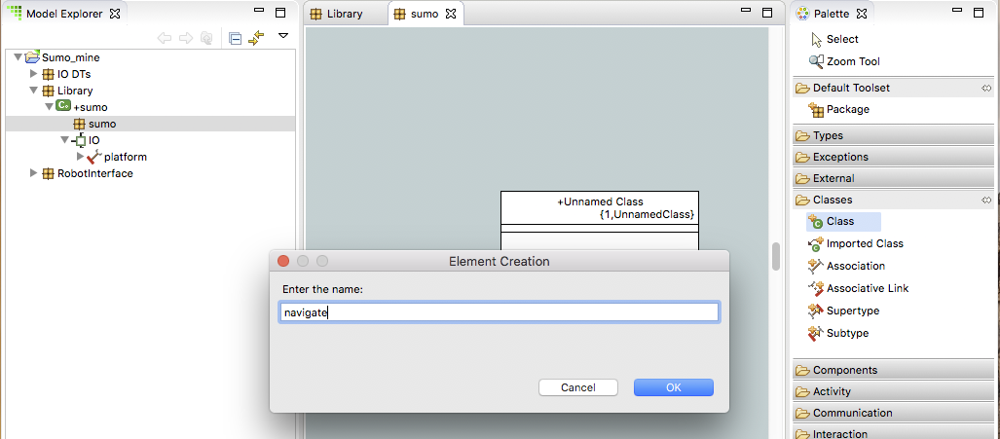

# Build a Sumo Model - Assignment 3    

1) Create package *sumo* under component *sumo*   

2) Double-click package *sumo* to open it on the canvas    

3) Use the **Palette > Classes > Class** tool to create a class on the canvas.  Name it
 *navigate*  
   

4) Create class *drive*  

5) Create class *steering*  

6) Click the **Association** tool in the Palette and drag between *navigate* and
*steering* on the canvas to draw an association   

7) Click the **Association** tool in the Palette and drag between *navigate* and
*drive* on the canvas to draw an association   

8) Select the association *R1* and then open the Properties view  
  * Expand Association Participant End
  * Expand Class As Simple Participant for *steering*  
  * Set the Text Phrase field to *navigates*  
  * Expand Class As Simple Participant for *navigate*  
  * Set the Text Phrase field to *steers for*  
  * You can drag the phrases around on the canvas to reposition them and use the bendpoints
  on the association line to add turned segments to the line  

   

9) Select the association *R2* and then open the Properties view  
  * Expand Association Participant End
  * Expand Class As Simple Participant for *drive*  
  * Set the Text Phrase field to *directs*  
  * Expand Class As Simple Participant for *navigate*  
  * Set the Text Phrase field to *motivates*  

10) Right-click on *navigate* and select **New > Attribute**. Name the 
attribute *retreat_duration*   

11) Right-click on *navigate* and select **New > Attribute**. Name the 
attribute *target_duration*   

12) Right-click on *drive* and select **New > Attribute**. Name the 
attribute *speed*   

13) Right-click on *drive* and select **New > Operation**. Name the 
operation *forward*   

14) Right-click on *drive* and select **New > Operation**. Name the 
operation *reverse*   

15) Right-click on *drive* and select **New > Operation**. Name the 
operation *stop*     

 

### Submitting your assignment
* Take a screenshot of your BridgePoint with Model Explorer view expanded to show all the 
elements you have just created.  
* Open the BridgePoint support issue you created in [homework 1.1](../homework/1.1.html). 
* Edit the issue, scroll down to the Edit field:  
  * Change the Status to "Feedback"  
  * Change the Assignee to "cstarrett"  
  * Add a Note that this assignment is completed 
  * Use the Choose Files button to attach your screenshot  
* Click the Submit button  

 

You are now ready to proceed to the [next step](./sumo_create4.html)

 
 
[Back to assignment list](.)  
