# Sumo Robot Class Project

## 1. Overview

The goal of this project is to build a sumo robot application based on the
example application in the "models" repository. The use of BridgePoint,
Verifier, model compilers and other tools will be learned as the project
progresses. A successful sumo robot application is one which obeys the rules of
the game and wins more than 50% of the time.

The sumo robot game consists of a sumo ring and two identical LEGO robots. The
ring is made up of a white background with a black ring printed on it (about 1
meter in diameter). Both robots are placed in the center of the ring side by
side facing opposite directions. The robots are activated at the same time. The
robots must delay exactly 2 seconds (to allow humans to clear the ring) and then
they may begin moving. The robots must stay within the black ring and attempt to
push one another out of the ring. The last robot remaining within the ring is
the winner.

## 2. Prerequisites

2.1 Build the sumo robot using [these
instructions](../../sumo/).

2.2 Set up your EV3RT development workspace following the guide
[here](http://ev3rt-git.github.io/get_started/). Run the sample application.

2.3 Clone your fork of the "models" repository. Import the "Sumo", "Sumo
Simulator", and "MCLMShared" projects. If you do not know how to do this, see
the guide [here](../homework/1.3.html).

2.4 Run the application in Verifier. Follow the instructions here to get started
with Verifier and code gen
[here](../sumo_start.html).

2.5 Generate code for the Sumo application.  Assure that you are using the MCLM
version of BridgePoint found
[here](https://s3.amazonaws.com/xtuml-releases/lego-build/buildfiles.html).

2.6. Make a new directory inside the EV3 repo: `mkdir -p <ev3_repo>/sdk/workspace/sumo`
Copy the contents of the "src" folder of your Sumo project into this new "sumo"
folder. Copy "Makefile.inc" and "app.cfg" from the "gen" folder into this
directory as well.

2.7 Build the app and copy it onto the SD card. You should have done this
already in step 2 with the example app, so you shouldn't need any further
instructions.

2.8 Test the robot on a sumo ring.

## 3. Grading

Projects will be graded on completeness and effectiveness. To enable grading
_**Each milestone in section 4 must have a git commit and the commit
message must contain the milestone number. These commits must be pushed to your
fork on Github.com. Failure to include each milestone for each git commit will
result in loss of credit.**_ Projects will also be graded on how well the
application works -- does it obey the rules and does it win more than half of
the time.

Final submission guidelines will be outlined by your instructor.

## 4. Milestones

There are ten (10) milestones in this section:  4.1 - 4.10.  The milestones
are ordered from simple to complex.  It is the goal of the project to complete
each milestone in sequence and ultimately having knowlege to make a superior
sumo robot application that wins!

### 4.1 Change the name of the sumo

* Navigate to and open "Library > sumo > IO > platform > init"
* On line 16, change "Teacher" to your name.
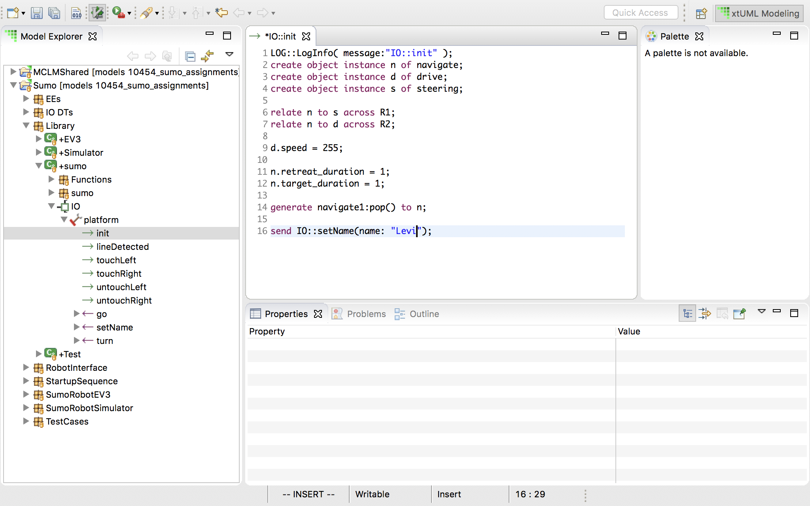
* Run the model in the simulator and see that your name is shown on the sumo
  ring in the simulator. If you need help running the Verifier and the
  simulator, see [this guide](https://xtuml.github.io/xtuml-class/sumo_start.html)
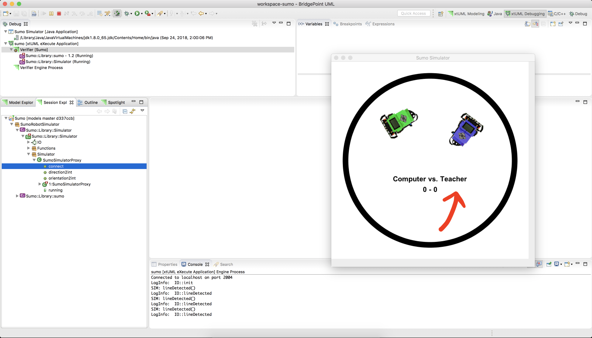
* Your name will appear on the sumo ring (as marked by the arrow).

### 4.2 Change the reversing duration

* Reversing is controlled by a period of time. If the time period is shorter,
  the robot will not reverse as far.
* Again, navigate to and open "Library > sumo > IO > platform > init"
* On line 11, see that "retreat_duration" is set to 1.
* Navigate to "Library > sumo > sumo > navigate > retreat_duration". Note in the
  "Properties" pane that the type of this class attribute is "integer".
* Back in "IO::init" on line 11, change the value of "retreat_duration". Run the
  simulator and observe the difference in behavior. Experiment with this until
  you get a value you are happy with.

### 4.3 Change the turning (targeting) duration

* Turning is controlled by a period of time. If the time period is shorter,
  the robot will not turn as far.
* Again, navigate to and open "Library > sumo > IO > platform > init"
* On line 12, see that "target_duration" is set to 1.
* Navigate to "Library > sumo > sumo > navigate > target_duration". Note in the
  "Properties" pane that the type of this class attribute is "integer".
* Back in "IO::init" on line 12, change the value of "target_duration". Run the
  simulator and observe the difference in behavior. Experiment with this until
  you get a value you are happy with.
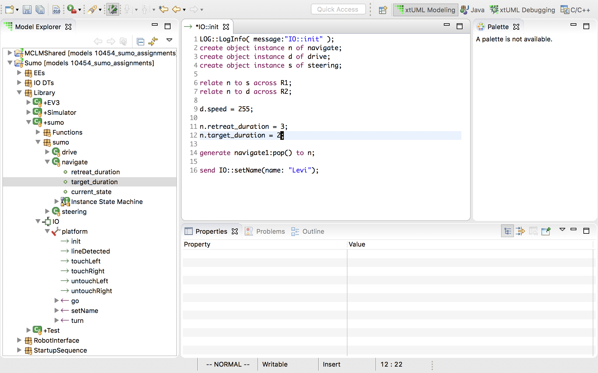
* Time spent turning and reversing is time where the robot is vulnerable to
  attack. Times should be kept as short as practical in order to have a winning
  strategy.

### 4.4 Change the turning duration so that the robot goes directly back and forth across the same path

* In order to make the robot travel back and forth in a straight line across the
  ring, we will need to be a little more precise -- 1 second turn is too short
  and 2 second turn is too long.
* Navigate to "Library > sumo > sumo > navigate > target_duration". Let's change
  this attribute from "integer" to "real" so we can achieve finer granularity in
  turning times.
* Before changing the type of a model element, it is good to see where it is
  referenced to assure that changing the type will not cause unexpected changes
  in behavior.
  * Select "Search > Search" (or click the flashlight icon in the tool bar).
  * Make sure the "xtuml Search" tab is selected.
  * Type "target_duration" in the "Search text" box.
  * In the "Limit to" section, check "Element Names" and "Action Language".
  * Click "Search".
  * In the serach results you will see three matches:
    * The first is the "IO::init" body we have already been working in where the
      value is set.
    * The second is in the "targeting" state in the the "navigate" instance
      state machine where it is multiplied by a conversion factor and passed to
      the timing bridge to create a timed event.
    * The last is in the navigate class itself where the attribute is defined.

  * Now that we've checked all the occurences of "target_duration" we can assure
    ourselves that changing the type from "integer" to "real" will not
    negatively affect the application behavior.
* Right click "target_duration" then select "Set Type...". Select "real" from
  the type picker and click "Ok".
* Now, go back to the "IO::init" body and experiment with decimal values of
  "target_duration" to get the most straight line path. Note that because the
  simulation is based on a physics engine and the timing is decoupled from the
  simulator, the best value _may be different on different machines_. There is
  no right answer.
* _Question: if you get the timing perfect so the simulator runs in a straight
  line and then load the application onto the physical robot, would it also run
  in a straight line? Why or why not?_

### 4.5 Start by turning instead of going straight

* Navigate to "Library > sumo > sumo > navigate" and double-click to view the
  instance state machine. Note the 4 states:
  * resting
  * attacking
  * retreating
  * targeting
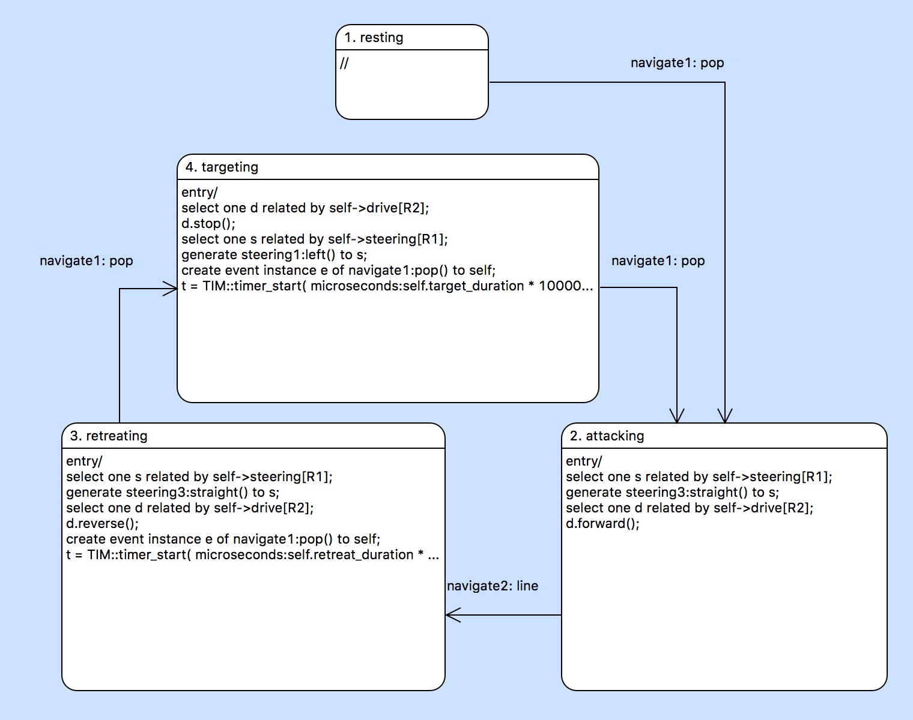
* Notice that the initial state (state with the lowest number) is resting. When
  the "pop" event is received, the instance enters the "attacking" state. From
  here the instance is in an endless loop where it attacks, retreats, and
  targets endlessly. The transitions between these states are dictated by timer
  and line detection events.
* We can change the initial behavior of the robot by changing the transition
  from the "resting" state to any of the states in the loop. At the moment, it
  transitions directly to the "attacking" state.
* Select the transtion from "resting" to "attacking", right click and delete the
  transition.
* Use the palette to select the transtion tool. Click and drag to draw a new
  transtion between the "resting" state and the "targeting" state.
* Right click the newly created transition and select "Assign Event...". Select
  "pop" from the following dropdown menu and click "Finish".
* Now when the robot is in the resting state and the timer pops, he will
  immediately start targeting before attacking. The new state machine should
  look something like this:
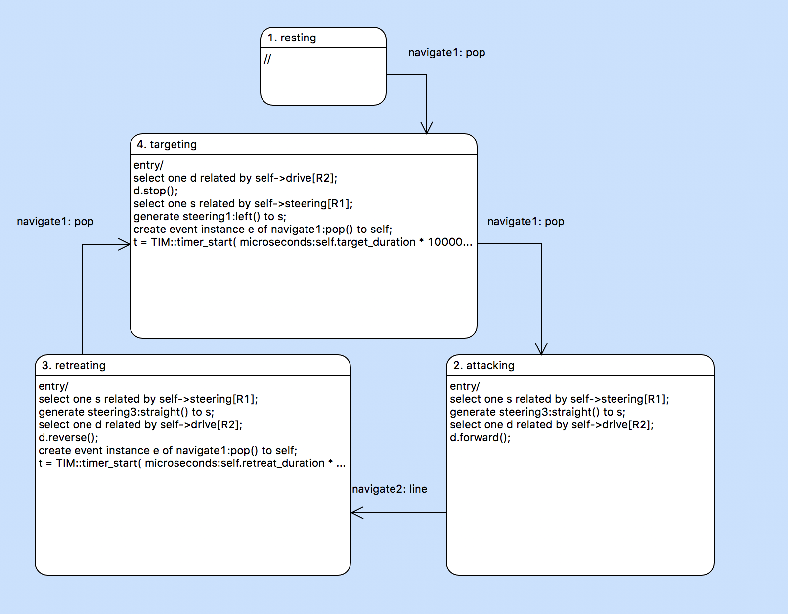
* Run the simulator again and observe the change in behavior. Go back to
  "IO::init" and manipulate the timings to try to gain an advantage over the
  simulator.
* _Optional: try changing the model so that the robot reverses first!_

### 4.6 Count each occurrence of detecting the line. Stop the robot after 3 detections.

* In order to count the number of times the line has been detected, we must add
  a new attribute to the "navigate" class.
* Right click the "navigate" class and select "New > Attribute". Give the
  attribute the name "line_detections". The default type for new attributes is
  "integer". We will not change the type as integer is good for counting.
* With the new attribute selected, in the "Properties" pane, find the "Default
  Value" field and enter "0". This value will be assigned to the attribute
  whenever a new instance is created

* Let's look at the state machine for the "navigate" class again. The instance
  transitions into the "retreating" state any time the "line" event is received
  in the "attacking" state. Here is a good place to insert our logic to count
  line detections.
  * Add a statement at the beginning of the "retreating" state to increment the
    "line_detections" attribute. The current instance of the class can be
    accessed by the "self" keyword.
  * Add a conditional statement ("if") to check if the "line_detections" value
    has reached the limit (3). Put a comment (//TODO) in the then block. In the
    else block, put the existing contents of the state action.
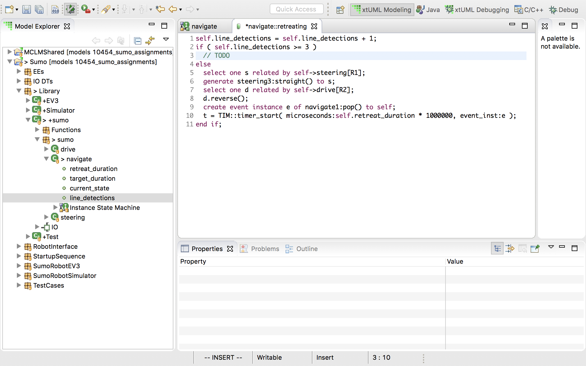
* Now we must add a way in the state machine to transition to a stopped state.
  We could create a new state for this purpose, or we could reuse the "resting"
  state. "resting" makes sense for what we will be doing so we will reuse that
  state. Additionally, this allows us to start the robot again if we wish by
  generating the "pop" event again.
* Add a new transition from the "retreating" state to the "resting" state. Use
  the palette to select the transition tool, then click and drag.
* Next, create a new event by right clicking, the blue canvas and selecting "New >
  Event". Name the event "halt". It is good to use a different event for each
  logically unique real world event. In this state machine, "pop" is always used
  with timers and "line" means the sensor has detected the line. The "touch" and
  "untouch" events are generated by the touch sensors. Now we have a "halt"
  event which signals an exceptional case.
* Right click the new transition and assign the "halt" event.

* In the "retreating" state action in the place of our "TODO" comment, generate
  the new halt event to self.
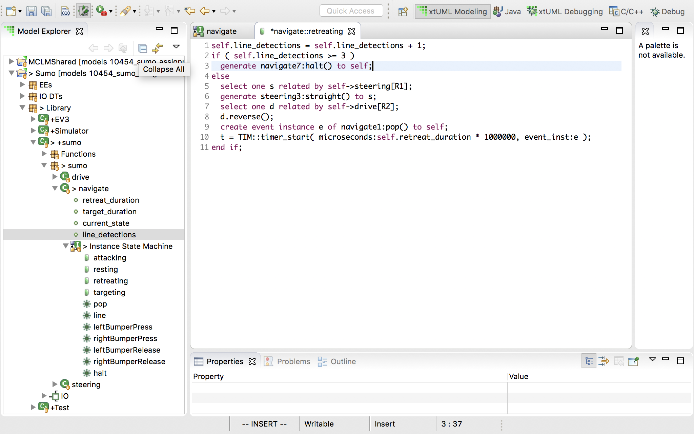
* Finally open the "resting" state. Select the singleton instance of "drive"
  through R2 and stop the robot. In xtUML, the action in the starting state is
  not executed initially -- it is only executed when transitioning into the
  state. Whenever we transition into the "resting" state, it makes sense to stop
  the wheels.
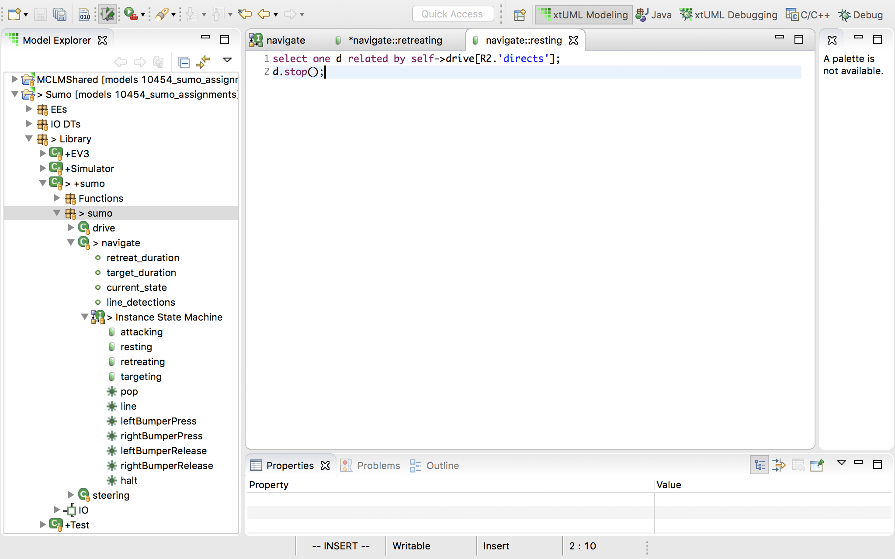

### 4.7 Instead of always turning the same direction, turn one direction this time and another direction next time.

* In order to alternate between turning left and right, we must add another new
  attribute to the "navigate" class.
* Right click the "navigate" class and select "New > Attribute". Give the
  attribute the name "last_turn". The default type for new attributes is
  "integer". We will need to change this to be something more expressive.
* Right click the new attribute and select "Set Type...". Select "Orientation"
  from the type picker window.
* Due to a limitation in the code generator, we cannot use default values for
  enumerated data types -- we must initialize them manually. Navigate to
  "IO::init" and add this statement on line 13 under the statement which assigns
  "target_duration": `n.last_turn = Orientation::left;`
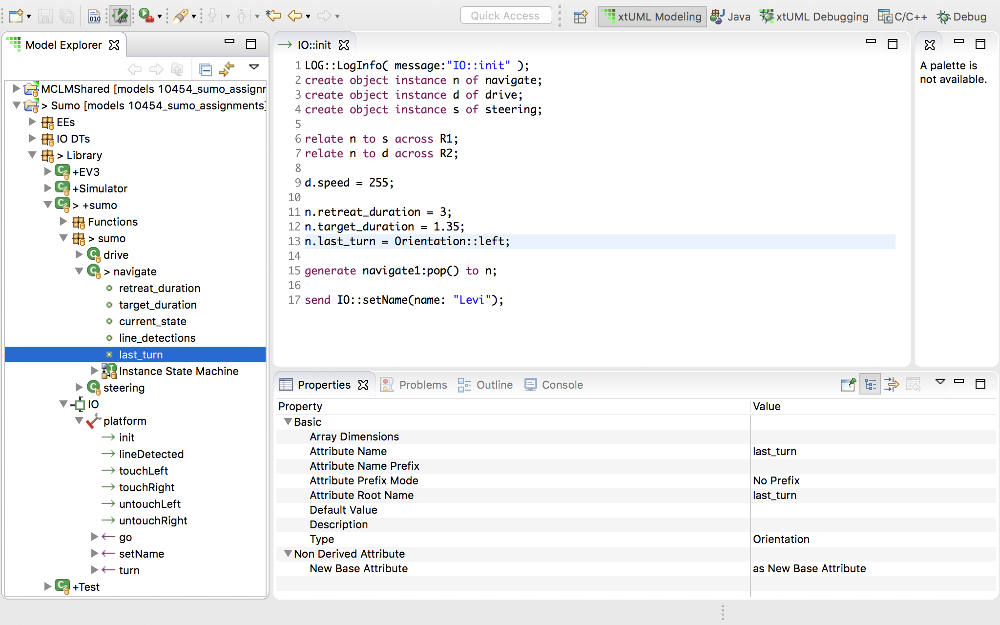
* Now we must make use of this attribute in the state machine. First, nagivage
  to and open the "retreating" state action in the navigate state machine. We no
  longer want the robot to stop after 3 line detections, so let's increase the
  number to 300. Now the robot should go for a long time.
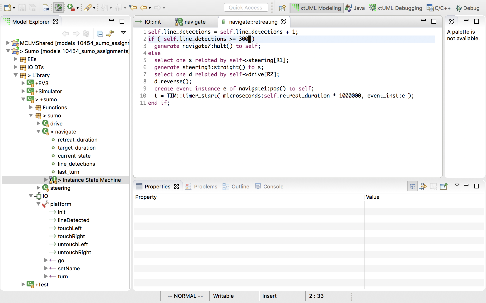
* Open the "targeting" state action and notice on line 4 that the "left" event
  is always generated to the steering instance. We want to generate "left" if
  the last turn was right, but we want to generate "right" if the last turn was
  "left".
* Add a conditional statement here which reads the new "last_turn" attribute to
  introduce this new behavior. Remember that you must also update the value of
  "last_turn" to accurately represent the last turn that has occurred.
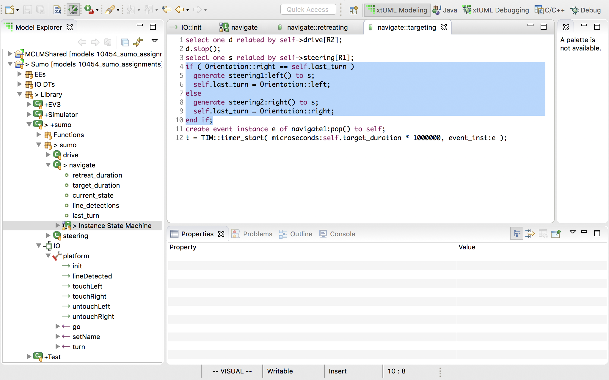

### 4.8 Add a response to touch sensor input. Demonstrate by "injecting" a touch signal while running the Verifier.

* Now we will add some behavior based on the touch sensor input. For this demo
  we will simply cause the touch sensors to behave like sensing the line -- the
  sumo will retreat, turn, and continue attacking.
* In the "navigate" state machine, use the transition tool to draw two new
  transitions from the "attacking" to the "retreating" state. Assign
  "leftBumperPress" to one of the transitions and "rightBumperPress" to the
  other transition.
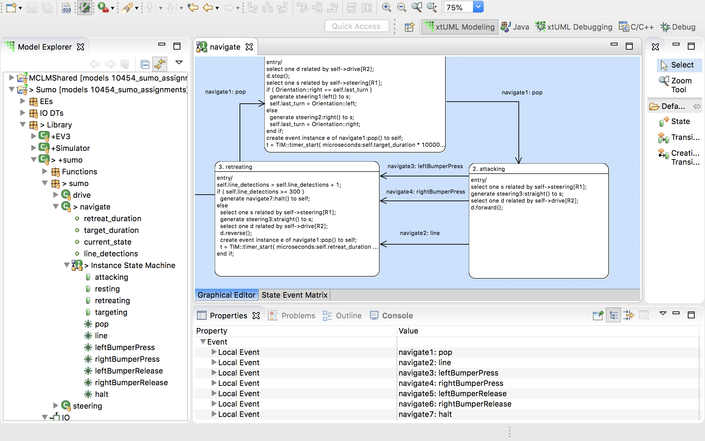
* You can demonstrate the behavior by executing the interface signals
  "touchLeft" and "touchRight" in the "IO" port while the Verifier simulation is
  running. Injecting signals in this way is a good way to black box test
  applications without the need for hardware or a simulator. _Important note:
  you must execute the signal on the "sumo" component and not the "Simulator"
  component._
* Notice in the following animation how the navigate instance state machine
  changes when the signal is executed.
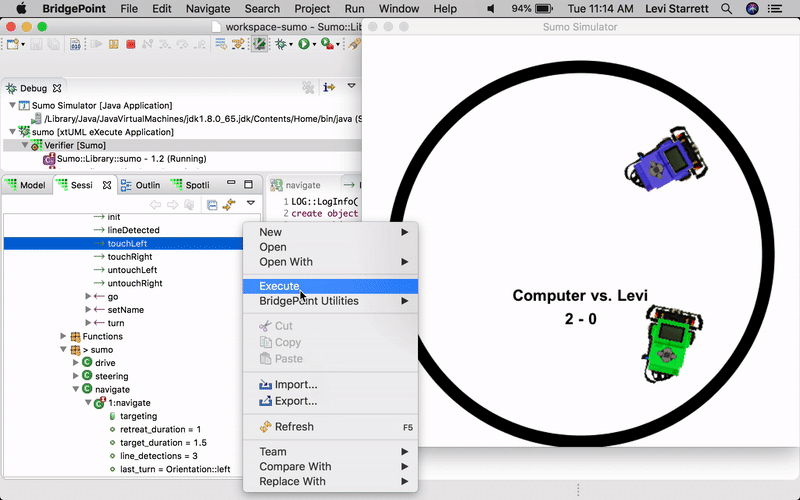
* This particular behavior is not very strategic, but it helps you to understand
  how to use and test the bumpers. Explore with this to see if you can come up
  with behavior that does increase the odds of winning.

### 4.9 Implement a winning strategy

* Now that you are familiar with xtUML modeling, Verifier, the Sumo Simulator,
  and the sumo application itself, it is your task to use what you've learned to
  create a strategy that wins. Be creative!
* Here are a few tips:
  * Simple is usually better. Adding complexity to the application or trying to
    be "too smart" usually results in a robot which is prone to fail. Think of a
    simple strategy and do it well instead of trying to implement a highly
    complex strategy poorly.
  * Sumo is a game of odds. The nature of the game depends a lot on luck.
    Because of this, a winning strategy is not a robot that is able to win every
    time, but a robot that does a few things to tip the odds in its favor.
  * Limit the time your robot is vulnerable. Reversing and turning are times
    when your robot is vulnerable to attack. Try to minimize these times.
  * Have fun! This exercise is all about creativity. Don't be afraid to make
    changes to the model -- add new classes, states, transitions, etc.
* In your commit message, describe your strategy.

### 4.10 Make a victory dance

* Implement a sequence of moves (a "dance") that your robot goes through when he
  has won. This is meant to be a fun exercise so be creative!
* Hint: detecting when you have won may be difficult. Consider the case when the
  bumpers are depressed and the line is detected. If an object is pressing on
  the bumpers _and_ the line is detected, you can be relatively certain you just
  pushed the other robot out of the ring. This is a good way to detect a win.
* In your commit message, describe your victory dance.
