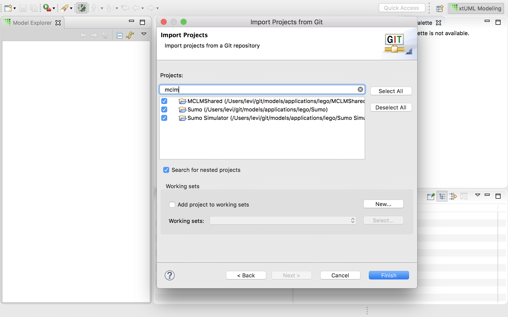
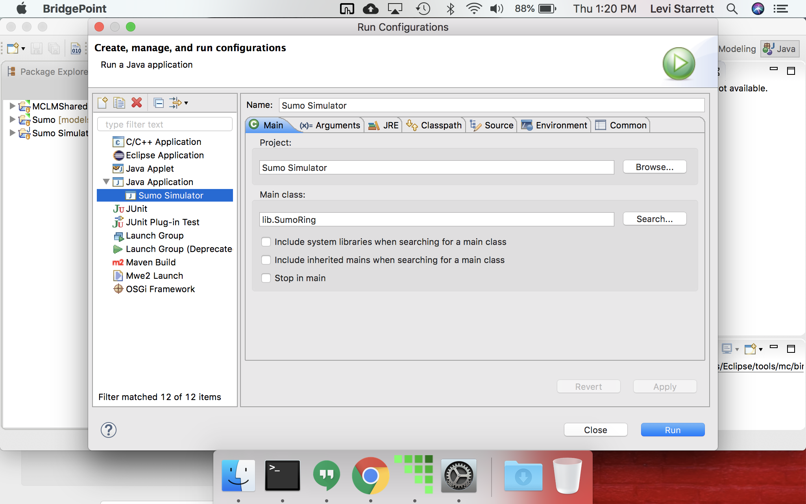
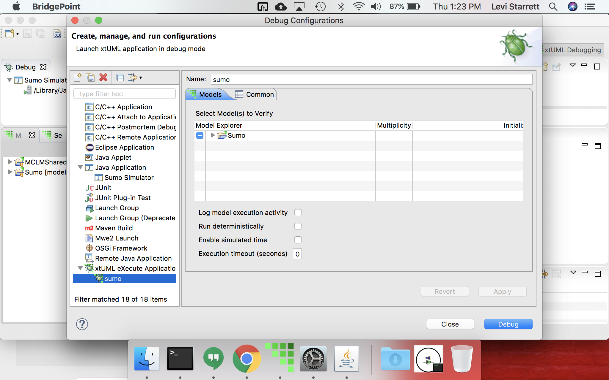
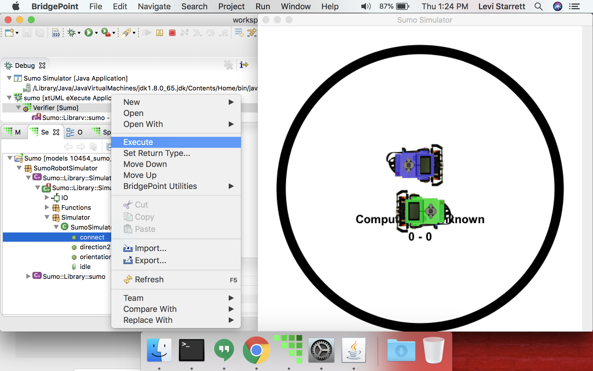
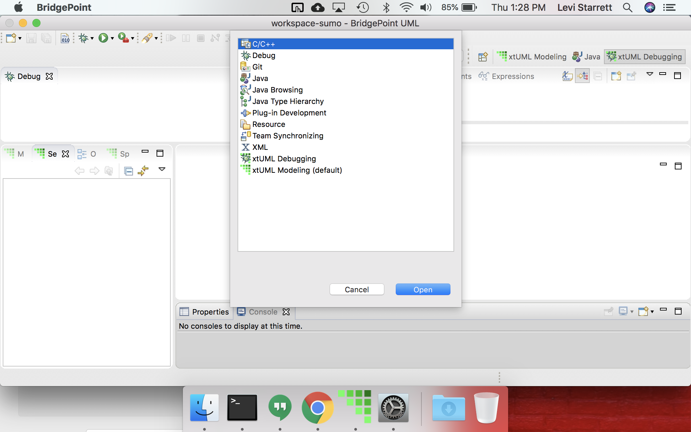
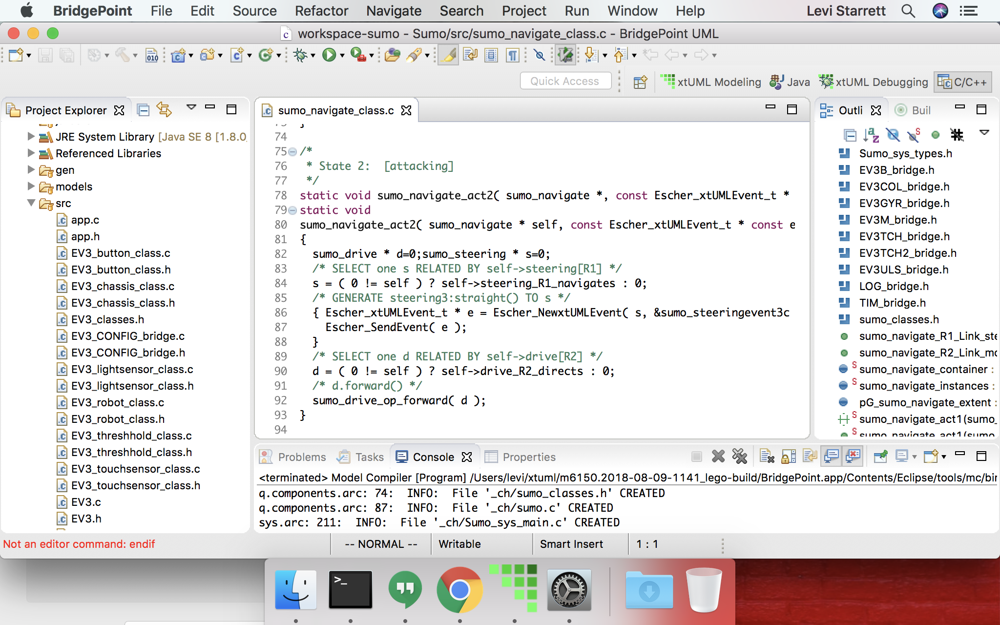

# Getting started with sumo

## 1. Import the required projects

* Import `Sumo`, `Sumo Simulator`, and `MCLMShared` from the `models` repository.
* See [this guide](https://youtu.be/a0AD57W-jOk) to see how to import projects.

## 2. Build the Java simulator

* Open the Java perspective

* Select "Project > Build All"

## 3. Launch the simulator

* Open run configurations (triangle next to the play button > Run Configurations)
* Open the Java Applications group and select "Sumo Simulator" and click "Run"

## 4. Launch Verifier

* Open the xtUML Debugging perspective

* Open debug configurations (triangle next to the beetle > Debug Configurations)
* Open the xtUML eXecute Applications group and select "sumo" and click "Debug"

* Naviage to "Sumo > SumoRobotSimulator > Sumo::Library::Simulator > Sumo::Library::Simulator > Simulator > SumoSimulatorProxy > connect". Right click and select "Execute".

* Watch the simulation run.
* When you are done, click the red square to terminate the simulation.

## 5. Generate code

* Open the C/C++ perspective

* Select the "Sumo" project, right click, and select "Build Project"

* Expand the project, navigate to the "src" directory and browse the generated code

